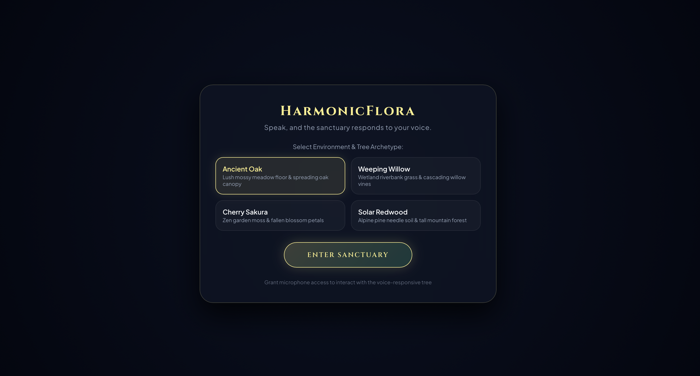
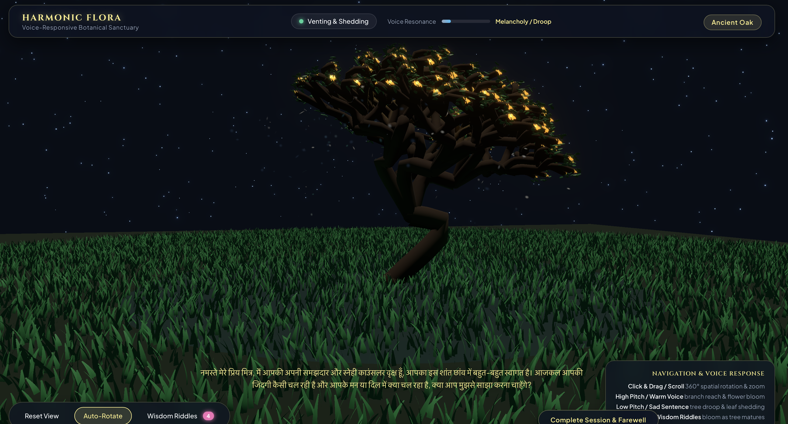
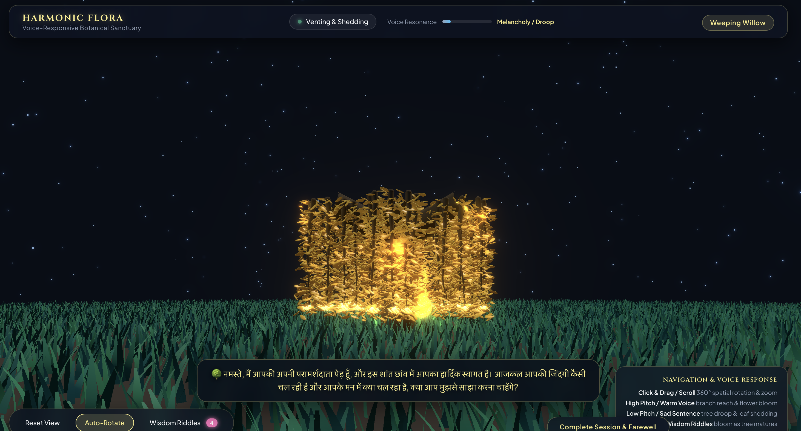
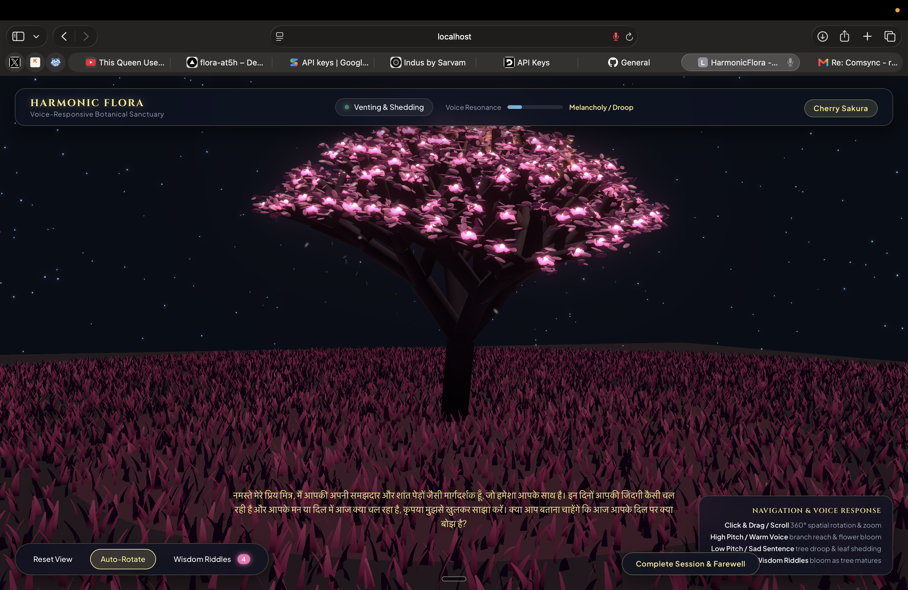

# flora

a voice counselor that grows a 3d tree while it listens to you.

## what it does

you speak. a tree listens. as you keep talking, the tree grows, branch by branch, from a bare trunk into a full canopy with leaves and blossoms. a gentle voice replies in hindi, reflecting back what you said and asking a soft follow up question. it is a small, calm space where talking out loud makes something quietly bloom in front of you.

## what it is really about

this is not a productivity tool and it is not trying to fix you. it is about being heard, and about the slow floral love that people who care for plants already understand. you water a plant, you talk to it, you watch it grow, and somewhere in that patience you feel a little less alone. flora takes that feeling and gives it a voice. it is meant for young people who like plants, who talk to them, who find comfort in watching green things come alive. the tree is the listener that never rushes you.

## features

- voice in, voice out. you speak, it transcribes, it thinks, it speaks back.
- a 3d tree that grows as branches, not as size. the more you speak, the more of the tree is revealed, trunk first, then limbs, then twigs, then leaves, then flowers.
- multilingual listening. it understands hindi, english, and hinglish code switching, so it hears you whether you mix languages or not.
- a warm hindi counselor voice that mirrors your words instead of giving generic lines.
- barge in. if you start talking while the tree is speaking, it stops and listens to you.
- live captions. you can see what it heard you say, and read its reply on screen.
- four tree species to choose from, each with its own shape and mood.
- a distant overhead sun, a soft night ground, drifting motes, and a full 360 degree orbit camera so you can look at the tree from any angle.

## what we tuned and why

we did not train a custom model. what we tuned is the pipeline, the prompt, and the numbers that make it feel alive and responsive. here is what the important values are and why they are what they are.

- frame size of 512 samples. at roughly 48 khz this is about 10 milliseconds of audio per frame, and it is a power of two so the fft stays fast. a 1024 point fft gives fine enough frequency bins to track pitch in the 70 to 500 hz range while still reacting almost instantly.
- noise calibration of 1000 milliseconds. we listen to one second of your silence at the start to measure the room noise floor. one second is long enough to average out random blips but short enough that it does not feel like waiting.
- voice detection uses two thresholds, 9 db to start and 4 db to stop, above the noise floor. this is hysteresis. you have to be clearly loud to count as speaking, but you only drop out when you go quiet, so your speech is not chopped up on small dips between words.
- voice hold of 600 milliseconds. after your energy drops we keep counting you as speaking for a little longer, so a natural pause between words does not end your turn early.
- deepgram endpointing of 300 milliseconds. the transcriber finalises a phrase after 300 milliseconds of silence. fast enough to feel responsive, slow enough to not cut you off mid breath.
- utterance end of 1000 milliseconds. a full second of silence marks the real end of your turn as a backstop.
- audio buffer of 4096 samples for streaming, which is about 85 milliseconds at 48 khz. this balances streaming latency against how often we send packets and how much cpu it costs.
- keep alive ping every 8000 milliseconds. deepgram drops an idle socket after about 10 seconds, so we ping just under that to keep it warm while you pause.
- token time to live of 30 seconds. the speech token only needs to live long enough to open the socket, so a short life keeps it safer.
- listening watchdog of 14000 milliseconds. if a reply ever fails to signal that it finished, we auto resume listening after 14 seconds so the app can never get stuck silent.
- barge in threshold of about 6 frames, roughly 100 milliseconds. you have to speak over the tree for a short run before it stops, so a cough or a bit of echo does not make it cut itself off.
- reply limit of 256 tokens and temperature 0.35. two to three short hindi sentences fit comfortably, and a low temperature keeps the voice warm but on topic and steady.
- last 4 turns of memory. enough context to feel continuous without bloating the prompt and slowing the reply.
- growth speed of 0.42 per second with an energy gate of 0.08. it takes a few seconds of real speech to grow the whole tree, and the gate means quiet room noise does not grow it on its own.
- text to speech at pace 1.05, slightly quicker than natural, so the voice feels alive but still calm.

## what problems it solves, honestly

the goal was a loop that feels like a real conversation with something that is actually paying attention. here is where it landed.

- can it hear you. yes. the earlier version only understood hindi through the browser and missed anything mixed with english. switching to a streaming multilingual transcriber fixed that, and it now hears hindi, english, and hinglish.
- is the latency decent. yes, honestly it is good. the transcriber streams while you talk, the reply model is a fast lite model, and the voice is a low latency service, so the gap between you finishing and the tree replying is short and comfortable.
- does the interrupt work. mostly yes. if you talk over the tree it will stop and listen, and echo cancellation on the mic keeps it from hearing itself. but this is the rough edge. sometimes it cuts off a little early, sometimes a loud room or leftover echo trips it, and once in a while the resume after an interrupt misfires or throws. the interrupt is the next thing we are refining. the latency and the listening are solid, the interrupt is good but not perfect yet.

## running it

copy the example env, add your keys, then run the backend and the frontend.

- google key for the counselor replies
- sarvam key for the hindi voice
- deepgram key for the streaming transcriber

```
cp .env.example .env
npm install
npm run api
npm run dev
```

works best in chrome or edge, but also runs in safari since the mic capture uses raw audio instead of a container format.

## file structure

```
index.html              the page shell and intro overlay
vite.config.ts          dev server and the proxy to the local api
vercel.json             deploy config for the hosted api functions
package.json            scripts, dev runs vite, api runs the local server

api/
  server.js             local dev backend, serves all three api routes from .env
  counselor.ts          hosted function, the counselor reply from gemini
  sarvam-tts.ts         hosted function, hindi text to speech
  deepgram-token.ts     hosted function, mints a short lived speech token

src/
  main.ts               wires everything together, the main voice loop and barge in
  config.ts             every tunable number lives here
  styles.css            styling

  audio/
    mic.ts              opens the mic with echo cancellation
    calibrate.ts        measures the room noise floor
    vad.ts              voice activity detection with hysteresis
    features.ts         loudness and spectral features
    pitch.ts            pitch tracking
    smoothing.ts        smoothing helpers
    counselorSpeech.ts  plays the tree's voice, sarvam first then a browser fallback
    stt.ts              the old browser only transcriber, kept for reference

  stt/
    deepgram.ts         the streaming multilingual transcriber that is actually used
    commands.ts         keyword to visual event mapping

  mapping/
    controls.ts         turns audio features into plant controls

  render/
    threeSketch.ts      scene, camera, sun, the render loop
    tree3d.ts           the tree itself and the branch by branch growth
    lifecycle.ts        stage, confidence, and the voice growth accumulator
    materials.ts        per species materials and configs
    backdrop3d.ts       ground and sky
    grass3d.ts          grass
    particles3d.ts      motes and falling petals
    riddles3d.ts        riddle blossoms
    plant.ts, lsystem.ts, sketch.ts, palette.ts, particles.ts   earlier 2d prototype pieces

  ui/
    overlay.ts          the species picker intro
    hudUI.ts            the heads up display
    counselorUI.ts      the finish session button
    debug.ts            the debug panel

  riddles.ts            riddle content and unlock logic
```

## Gallery & demo

### The main interface

<video src="https://github.com/shnavii11/flora/raw/master/assets/main_interface.mp4" controls muted width="100%"></video>

### Watch it grow

<video src="https://github.com/shnavii11/flora/raw/master/assets/plant_growing.mp4" controls muted width="100%"></video>

### Screens








